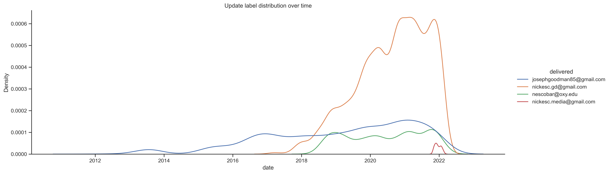

# Gmail Explorer v2

###### By [nickesc](https://github.com/nickesc) / [N. Escobar](https://nickesc.com)

Welcome back to Gmail Explorer, where last time, we used the Gmail API to grab a list of every email I've ever received, sift throught them, patching up some missing data and pruning things we didn't want. Then, we spent some time visualizing our preliminary data and analyzing what we saw. We're going to expand on that here, and look more closely at some of the trends we saw, while at the same time exploring some avenues we didn't get to go down in the last part. For a more comprehensive description of the dataset, please refer to [the](https://github.com/nickesc/Gmail-Explorer-Reader) [other](https://github.com/nickesc/Gmail-Explorer-Imputer) [parts](https://github.com/nickesc/Gmail-Explorer-Visualizer).

I wasn't really interested in using Machine Learning in this project. I really don't care for ML, it gives me a bad feeling in the pit of my stomach, and I found very little value in it. I don't want to engage with that technology if I can avoid it. I also wasn't interested much in making predictions, what fun is predicting if a message is going to be spam? I was much more interested in continuing to look at various trends and email history and over time, and just having fun finding out more information about my email use and inbox through analysis of the data, which is what I spent the bulk of my time on.

First things first, let's get our imports and notebook formatting stuff out of the way:


```python
import os
import csv
import pandas as pd
import numpy as np
import matplotlib.pyplot as plt
import seaborn as sns
import base64
import datetime
import sklearn

from sklearn import preprocessing
from sklearn.model_selection import train_test_split,GridSearchCV
from sklearn.linear_model import LogisticRegression
from sklearn.metrics import classification_report,confusion_matrix
from sklearn.svm import SVC


%matplotlib inline
from matplotlib import rcParams
import matplotlib_inline.backend_inline
from IPython.display import clear_output, display
pd.set_option('max_columns', None)
rcParams['figure.figsize'] = 10,10
sns.set(rc={'figure.figsize':(11.7,8.27)})
sns.set(rc={"figure.dpi":300, 'savefig.dpi':300})
sns.set_context('notebook')
sns.set_style("ticks")
matplotlib_inline.backend_inline.set_matplotlib_formats('png')
```

Next, we load in our data.


```python
emails = pd.read_csv("../Midterm/imputer/imputed/recieved.csv", index_col=[0])
```

There's a few transformations we're going to make to the dataset here:


```python
def getJG(string):
    if (string == "josephgoodman85@gmail.com"):
        return 1
    else:
        return 0


def getGD(string):
    if (string == "nickesc.gd@gmail.com"):
        return 1
    else:
        return 0


def getNE(string):
    if (string == "nescobar@oxy.edu"):
        return 1
    else:
        return 0


def getNM(string):
    if (string == "nickesc.media@gmail.com"):
        return 1
    else:
        return 0
```

First, we'll grab categorical columns for our four email addresses,
- `JG`: `josephgoodman85@gmail.com`
- `GD`: `nickesc.gd@gmail.com`
- `NE`: `nescobar@oxy.edu`
- `NM`: `nescobar@oxy.edu`


```python
def getThread(Id, threadId):
    if (Id != threadId):
        return 1
    else:
        return 0


def getUpdates(string):
    if ("CATEGORY_UPDATES" in string):
        return 1
    else:
        return 0


def getPersonal(string):
    if ("CATEGORY_PERSONAL" in string):
        return 1
    else:
        return 0


def getPromotions(string):
    if ("CATEGORY_PROMOTIONS" in string):
        return 1
    else:
        return 0


def getSocial(string):
    if ("CATEGORY_SOCIAL" in string):
        return 1
    else:
        return 0


def getForums(string):
    if ("CATEGORY_FORUMS" in string):
        return 1
    else:
        return 0


def getStarred(string):
    if ("STARRED" in string):
        return 1
    else:
        return 0


def getImportant(string):
    if ("IMPORTANT" in string):
        return 1
    else:
        return 0


def getSpam(string):
    if ("SPAM" in string):
        return 1
    else:
        return 0


def getTrash(string):
    if ("TRASH" in string):
        return 1
    else:
        return 0
```

Next, we'll do a similar thing for the labels; we check if the labels contain the regular strings, and assign True or False based on that.
> Important to note is that emails can have any, all or none of these labels


```python
def getDecodeLen(string):
    try:
        decode = base64.urlsafe_b64decode(string).decode('utf-8')
    except:
        decode = ""
    return len(decode)


def getLen(string):
    return len(string)
```

Last, we convert our subject and body contents to their character lengths.

> My data, unmodified, is about 6 gigabytes. It's a bit of a pain to manage and load in every time, solely because the bodies and subjects of the messages are included. Without them, it's about 20 megabytes. In the next step we swap the email subject and body contents for a character count and end up with a much more manageable dataset. At the end, we export the smaller `.csv` so we don't have to spend ten-minutes loading the file in every time.

> I considered for a little while doing string analysis and some language processing on the bodies, but it's far outside my skills, and I didn't feel confident with it as I was exploring it.


```python
emails['JG'] = emails['delivered'].apply(getJG)
emails['GD'] = emails['delivered'].apply(getGD)
emails['NE'] = emails['delivered'].apply(getNE)
emails['NM'] = emails['delivered'].apply(getNM)
emails['thread'] = emails.apply(lambda x: getThread(x['id'], x['threadId']),axis=1)
emails['updates']=emails['labels'].apply(getUpdates)
emails['personal']=emails['labels'].apply(getPersonal)
emails['promotions']=emails['labels'].apply(getPromotions)
emails['social']=emails['labels'].apply(getSocial)
emails['forums']=emails['labels'].apply(getForums)
emails['spam']=emails['labels'].apply(getSpam)
emails['starred']=emails['labels'].apply(getStarred)
emails['important']=emails['labels'].apply(getImportant)
emails['trash']=emails['labels'].apply(getTrash)
emails.to_csv('messages.csv')
```


```python
emails = pd.read_csv('messages.csv',index_col=[0])

emails
```


<div>
<style scoped>
    .dataframe tbody tr th:only-of-type {
        vertical-align: middle;
    }

    .dataframe tbody tr th {
        vertical-align: top;
    }

    .dataframe thead th {
        text-align: right;
    }
</style>
<table border="1" class="dataframe">
  <thead>
    <tr style="text-align: right;">
      <th></th>
      <th>id</th>
      <th>threadId</th>
      <th>from</th>
      <th>delivered</th>
      <th>to</th>
      <th>internalDate</th>
      <th>dateTime</th>
      <th>year</th>
      <th>month</th>
      <th>day</th>
      <th>labels</th>
      <th>sizeEstimate</th>
      <th>subject</th>
      <th>body</th>
      <th>JG</th>
      <th>GD</th>
      <th>NE</th>
      <th>NM</th>
      <th>thread</th>
      <th>updates</th>
      <th>personal</th>
      <th>promotions</th>
      <th>social</th>
      <th>forums</th>
      <th>spam</th>
      <th>starred</th>
      <th>important</th>
      <th>trash</th>
    </tr>
  </thead>
  <tbody>
    <tr>
      <th>0</th>
      <td>1340953ff42a62c8</td>
      <td>1340953ff42a62c8</td>
      <td>accounts@mochigames.com</td>
      <td>josephgoodman85@gmail.com</td>
      <td>josephgoodman85@gmail.com</td>
      <td>1323006426000</td>
      <td>2011-12-04 08:47:06</td>
      <td>2011</td>
      <td>12</td>
      <td>4</td>
      <td>['CATEGORY_UPDATES']</td>
      <td>7036</td>
      <td>35</td>
      <td>787</td>
      <td>1</td>
      <td>0</td>
      <td>0</td>
      <td>0</td>
      <td>0</td>
      <td>1</td>
      <td>0</td>
      <td>0</td>
      <td>0</td>
      <td>0</td>
      <td>0</td>
      <td>0</td>
      <td>0</td>
      <td>0</td>
    </tr>
    <tr>
      <th>1</th>
      <td>136dc4cb8ea460d1</td>
      <td>136dc4cb8ea460d1</td>
      <td>pottermore@mail.pottermore.com</td>
      <td>josephgoodman85@gmail.com</td>
      <td>josephgoodman85@gmail.com</td>
      <td>1335135875000</td>
      <td>2012-04-22 19:04:35</td>
      <td>2012</td>
      <td>4</td>
      <td>22</td>
      <td>['CATEGORY_UPDATES']</td>
      <td>11169</td>
      <td>23</td>
      <td>8516</td>
      <td>1</td>
      <td>0</td>
      <td>0</td>
      <td>0</td>
      <td>0</td>
      <td>1</td>
      <td>0</td>
      <td>0</td>
      <td>0</td>
      <td>0</td>
      <td>0</td>
      <td>0</td>
      <td>0</td>
      <td>0</td>
    </tr>
    <tr>
      <th>2</th>
      <td>136dc4ddab520861</td>
      <td>136dc4ddab520861</td>
      <td>pottermore@mail.pottermore.com</td>
      <td>josephgoodman85@gmail.com</td>
      <td>josephgoodman85@gmail.com</td>
      <td>1335135950000</td>
      <td>2012-04-22 19:05:50</td>
      <td>2012</td>
      <td>4</td>
      <td>22</td>
      <td>['CATEGORY_PROMOTIONS']</td>
      <td>9236</td>
      <td>50</td>
      <td>6671</td>
      <td>1</td>
      <td>0</td>
      <td>0</td>
      <td>0</td>
      <td>0</td>
      <td>0</td>
      <td>0</td>
      <td>1</td>
      <td>0</td>
      <td>0</td>
      <td>0</td>
      <td>0</td>
      <td>0</td>
      <td>0</td>
    </tr>
    <tr>
      <th>3</th>
      <td>136ebd147fcd9bba</td>
      <td>136ebd147fcd9bba</td>
      <td>pottermore@mail.pottermore.com</td>
      <td>josephgoodman85@gmail.com</td>
      <td>josephgoodman85@gmail.com</td>
      <td>1335396221000</td>
      <td>2012-04-25 19:23:41</td>
      <td>2012</td>
      <td>4</td>
      <td>25</td>
      <td>['CATEGORY_UPDATES']</td>
      <td>9724</td>
      <td>26</td>
      <td>6992</td>
      <td>1</td>
      <td>0</td>
      <td>0</td>
      <td>0</td>
      <td>0</td>
      <td>1</td>
      <td>0</td>
      <td>0</td>
      <td>0</td>
      <td>0</td>
      <td>0</td>
      <td>0</td>
      <td>0</td>
      <td>0</td>
    </tr>
    <tr>
      <th>4</th>
      <td>13750efdfd5fd883</td>
      <td>13750efdfd5fd883</td>
      <td>pottermore@mail.pottermore.com</td>
      <td>josephgoodman85@gmail.com</td>
      <td>josephgoodman85@gmail.com</td>
      <td>1337092709000</td>
      <td>2012-05-15 10:38:29</td>
      <td>2012</td>
      <td>5</td>
      <td>15</td>
      <td>['CATEGORY_PROMOTIONS']</td>
      <td>33234</td>
      <td>52</td>
      <td>2318</td>
      <td>1</td>
      <td>0</td>
      <td>0</td>
      <td>0</td>
      <td>0</td>
      <td>0</td>
      <td>0</td>
      <td>1</td>
      <td>0</td>
      <td>0</td>
      <td>0</td>
      <td>0</td>
      <td>0</td>
      <td>0</td>
    </tr>
    <tr>
      <th>...</th>
      <td>...</td>
      <td>...</td>
      <td>...</td>
      <td>...</td>
      <td>...</td>
      <td>...</td>
      <td>...</td>
      <td>...</td>
      <td>...</td>
      <td>...</td>
      <td>...</td>
      <td>...</td>
      <td>...</td>
      <td>...</td>
      <td>...</td>
      <td>...</td>
      <td>...</td>
      <td>...</td>
      <td>...</td>
      <td>...</td>
      <td>...</td>
      <td>...</td>
      <td>...</td>
      <td>...</td>
      <td>...</td>
      <td>...</td>
      <td>...</td>
      <td>...</td>
    </tr>
    <tr>
      <th>87430</th>
      <td>17f14a27dd9a9b7d</td>
      <td>17f14a27dd9a9b7d</td>
      <td>no-reply@mail.instagram.com</td>
      <td>josephgoodman85@gmail.com</td>
      <td>josephgoodman85@gmail.com</td>
      <td>1645318654000</td>
      <td>2022-02-19 19:57:34</td>
      <td>2022</td>
      <td>2</td>
      <td>19</td>
      <td>['UNREAD', 'CATEGORY_SOCIAL', 'INBOX']</td>
      <td>26182</td>
      <td>58</td>
      <td>19858</td>
      <td>1</td>
      <td>0</td>
      <td>0</td>
      <td>0</td>
      <td>0</td>
      <td>0</td>
      <td>0</td>
      <td>0</td>
      <td>1</td>
      <td>0</td>
      <td>0</td>
      <td>0</td>
      <td>0</td>
      <td>0</td>
    </tr>
    <tr>
      <th>87431</th>
      <td>17f14af10caa271c</td>
      <td>17f14af10caa271c</td>
      <td>noreply@uber.com</td>
      <td>nickesc.gd@gmail.com</td>
      <td>nickesc.gd@gmail.com</td>
      <td>1645319490000</td>
      <td>2022-02-19 20:11:30</td>
      <td>2022</td>
      <td>2</td>
      <td>19</td>
      <td>['CATEGORY_PROMOTIONS', 'UNREAD', 'INBOX']</td>
      <td>126617</td>
      <td>34</td>
      <td>113185</td>
      <td>0</td>
      <td>1</td>
      <td>0</td>
      <td>0</td>
      <td>0</td>
      <td>0</td>
      <td>0</td>
      <td>1</td>
      <td>0</td>
      <td>0</td>
      <td>0</td>
      <td>0</td>
      <td>0</td>
      <td>0</td>
    </tr>
    <tr>
      <th>87432</th>
      <td>17f1575c1426497e</td>
      <td>17f1575c1426497e</td>
      <td>noreply@redditmail.com</td>
      <td>josephgoodman85@gmail.com</td>
      <td>josephgoodman85@gmail.com</td>
      <td>1645332512000</td>
      <td>2022-02-19 23:48:32</td>
      <td>2022</td>
      <td>2</td>
      <td>19</td>
      <td>['CATEGORY_PROMOTIONS', 'UNREAD', 'INBOX']</td>
      <td>103349</td>
      <td>49</td>
      <td>98530</td>
      <td>1</td>
      <td>0</td>
      <td>0</td>
      <td>0</td>
      <td>0</td>
      <td>0</td>
      <td>0</td>
      <td>1</td>
      <td>0</td>
      <td>0</td>
      <td>0</td>
      <td>0</td>
      <td>0</td>
      <td>0</td>
    </tr>
    <tr>
      <th>87433</th>
      <td>17f15a705a5f7989</td>
      <td>17f15a705a5f7989</td>
      <td>noreply@uber.com</td>
      <td>nickesc.gd@gmail.com</td>
      <td>nickesc.gd@gmail.com</td>
      <td>1645335740000</td>
      <td>2022-02-20 00:42:20</td>
      <td>2022</td>
      <td>2</td>
      <td>20</td>
      <td>['UNREAD', 'CATEGORY_UPDATES', 'INBOX']</td>
      <td>83724</td>
      <td>42</td>
      <td>72543</td>
      <td>0</td>
      <td>1</td>
      <td>0</td>
      <td>0</td>
      <td>0</td>
      <td>1</td>
      <td>0</td>
      <td>0</td>
      <td>0</td>
      <td>0</td>
      <td>0</td>
      <td>0</td>
      <td>0</td>
      <td>0</td>
    </tr>
    <tr>
      <th>87434</th>
      <td>17f15ab170b8f99e</td>
      <td>17f15a705a5f7989</td>
      <td>noreply@uber.com</td>
      <td>nickesc.gd@gmail.com</td>
      <td>nickesc.gd@gmail.com</td>
      <td>1645336007000</td>
      <td>2022-02-20 00:46:47</td>
      <td>2022</td>
      <td>2</td>
      <td>20</td>
      <td>['UNREAD', 'CATEGORY_PERSONAL', 'INBOX']</td>
      <td>90516</td>
      <td>42</td>
      <td>78840</td>
      <td>0</td>
      <td>1</td>
      <td>0</td>
      <td>0</td>
      <td>1</td>
      <td>0</td>
      <td>1</td>
      <td>0</td>
      <td>0</td>
      <td>0</td>
      <td>0</td>
      <td>0</td>
      <td>0</td>
      <td>0</td>
    </tr>
  </tbody>
</table>
<p>87435 rows × 28 columns</p>
</div>


And once we finally have that file loaded into the notebook, we'll convert our dateTime string to a datetime object, since it can't be stored like that in the `.csv`. We'll also make sure we're only looking at emails sent to one of those four addresses instead of any other that might be floating in the set (there are a few random ones), and we drop about 500 rows cluttering the data.

Finally, we create a clean, new dataframe with all the message data.


```python
emails['date'] = emails.apply(lambda row: datetime.datetime(row['year'], row['month'], row['day']), axis=1)

emails = emails[(emails['delivered'] == "josephgoodman85@gmail.com")
                | (emails['delivered'] == "nickesc.gd@gmail.com")
                | (emails['delivered'] == "nescobar@oxy.edu")
                | (emails['delivered'] == "nickesc.media@gmail.com")]

messages = emails[['delivered','from','to','id','threadId','internalDate','date', 'sizeEstimate','body','subject','year','month','day', 'JG', 'GD', 'NE', 'NM','updates','personal','promotions', 'social','forums','spam','starred','important','trash','thread']]
```


```python
print('Message Data')
display(messages)
display(messages.info())
messages.describe()
```

    Message Data


<div>
<style scoped>
    .dataframe tbody tr th:only-of-type {
        vertical-align: middle;
    }

    .dataframe tbody tr th {
        vertical-align: top;
    }

    .dataframe thead th {
        text-align: right;
    }
</style>
<table border="1" class="dataframe">
  <thead>
    <tr style="text-align: right;">
      <th></th>
      <th>delivered</th>
      <th>from</th>
      <th>to</th>
      <th>id</th>
      <th>threadId</th>
      <th>internalDate</th>
      <th>date</th>
      <th>sizeEstimate</th>
      <th>body</th>
      <th>subject</th>
      <th>year</th>
      <th>month</th>
      <th>day</th>
      <th>JG</th>
      <th>GD</th>
      <th>NE</th>
      <th>NM</th>
      <th>updates</th>
      <th>personal</th>
      <th>promotions</th>
      <th>social</th>
      <th>forums</th>
      <th>spam</th>
      <th>starred</th>
      <th>important</th>
      <th>trash</th>
      <th>thread</th>
    </tr>
  </thead>
  <tbody>
    <tr>
      <th>0</th>
      <td>josephgoodman85@gmail.com</td>
      <td>accounts@mochigames.com</td>
      <td>josephgoodman85@gmail.com</td>
      <td>1340953ff42a62c8</td>
      <td>1340953ff42a62c8</td>
      <td>1323006426000</td>
      <td>2011-12-04</td>
      <td>7036</td>
      <td>787</td>
      <td>35</td>
      <td>2011</td>
      <td>12</td>
      <td>4</td>
      <td>1</td>
      <td>0</td>
      <td>0</td>
      <td>0</td>
      <td>1</td>
      <td>0</td>
      <td>0</td>
      <td>0</td>
      <td>0</td>
      <td>0</td>
      <td>0</td>
      <td>0</td>
      <td>0</td>
      <td>0</td>
    </tr>
    <tr>
      <th>1</th>
      <td>josephgoodman85@gmail.com</td>
      <td>pottermore@mail.pottermore.com</td>
      <td>josephgoodman85@gmail.com</td>
      <td>136dc4cb8ea460d1</td>
      <td>136dc4cb8ea460d1</td>
      <td>1335135875000</td>
      <td>2012-04-22</td>
      <td>11169</td>
      <td>8516</td>
      <td>23</td>
      <td>2012</td>
      <td>4</td>
      <td>22</td>
      <td>1</td>
      <td>0</td>
      <td>0</td>
      <td>0</td>
      <td>1</td>
      <td>0</td>
      <td>0</td>
      <td>0</td>
      <td>0</td>
      <td>0</td>
      <td>0</td>
      <td>0</td>
      <td>0</td>
      <td>0</td>
    </tr>
    <tr>
      <th>2</th>
      <td>josephgoodman85@gmail.com</td>
      <td>pottermore@mail.pottermore.com</td>
      <td>josephgoodman85@gmail.com</td>
      <td>136dc4ddab520861</td>
      <td>136dc4ddab520861</td>
      <td>1335135950000</td>
      <td>2012-04-22</td>
      <td>9236</td>
      <td>6671</td>
      <td>50</td>
      <td>2012</td>
      <td>4</td>
      <td>22</td>
      <td>1</td>
      <td>0</td>
      <td>0</td>
      <td>0</td>
      <td>0</td>
      <td>0</td>
      <td>1</td>
      <td>0</td>
      <td>0</td>
      <td>0</td>
      <td>0</td>
      <td>0</td>
      <td>0</td>
      <td>0</td>
    </tr>
    <tr>
      <th>3</th>
      <td>josephgoodman85@gmail.com</td>
      <td>pottermore@mail.pottermore.com</td>
      <td>josephgoodman85@gmail.com</td>
      <td>136ebd147fcd9bba</td>
      <td>136ebd147fcd9bba</td>
      <td>1335396221000</td>
      <td>2012-04-25</td>
      <td>9724</td>
      <td>6992</td>
      <td>26</td>
      <td>2012</td>
      <td>4</td>
      <td>25</td>
      <td>1</td>
      <td>0</td>
      <td>0</td>
      <td>0</td>
      <td>1</td>
      <td>0</td>
      <td>0</td>
      <td>0</td>
      <td>0</td>
      <td>0</td>
      <td>0</td>
      <td>0</td>
      <td>0</td>
      <td>0</td>
    </tr>
    <tr>
      <th>4</th>
      <td>josephgoodman85@gmail.com</td>
      <td>pottermore@mail.pottermore.com</td>
      <td>josephgoodman85@gmail.com</td>
      <td>13750efdfd5fd883</td>
      <td>13750efdfd5fd883</td>
      <td>1337092709000</td>
      <td>2012-05-15</td>
      <td>33234</td>
      <td>2318</td>
      <td>52</td>
      <td>2012</td>
      <td>5</td>
      <td>15</td>
      <td>1</td>
      <td>0</td>
      <td>0</td>
      <td>0</td>
      <td>0</td>
      <td>0</td>
      <td>1</td>
      <td>0</td>
      <td>0</td>
      <td>0</td>
      <td>0</td>
      <td>0</td>
      <td>0</td>
      <td>0</td>
    </tr>
    <tr>
      <th>...</th>
      <td>...</td>
      <td>...</td>
      <td>...</td>
      <td>...</td>
      <td>...</td>
      <td>...</td>
      <td>...</td>
      <td>...</td>
      <td>...</td>
      <td>...</td>
      <td>...</td>
      <td>...</td>
      <td>...</td>
      <td>...</td>
      <td>...</td>
      <td>...</td>
      <td>...</td>
      <td>...</td>
      <td>...</td>
      <td>...</td>
      <td>...</td>
      <td>...</td>
      <td>...</td>
      <td>...</td>
      <td>...</td>
      <td>...</td>
      <td>...</td>
    </tr>
    <tr>
      <th>87430</th>
      <td>josephgoodman85@gmail.com</td>
      <td>no-reply@mail.instagram.com</td>
      <td>josephgoodman85@gmail.com</td>
      <td>17f14a27dd9a9b7d</td>
      <td>17f14a27dd9a9b7d</td>
      <td>1645318654000</td>
      <td>2022-02-19</td>
      <td>26182</td>
      <td>19858</td>
      <td>58</td>
      <td>2022</td>
      <td>2</td>
      <td>19</td>
      <td>1</td>
      <td>0</td>
      <td>0</td>
      <td>0</td>
      <td>0</td>
      <td>0</td>
      <td>0</td>
      <td>1</td>
      <td>0</td>
      <td>0</td>
      <td>0</td>
      <td>0</td>
      <td>0</td>
      <td>0</td>
    </tr>
    <tr>
      <th>87431</th>
      <td>nickesc.gd@gmail.com</td>
      <td>noreply@uber.com</td>
      <td>nickesc.gd@gmail.com</td>
      <td>17f14af10caa271c</td>
      <td>17f14af10caa271c</td>
      <td>1645319490000</td>
      <td>2022-02-19</td>
      <td>126617</td>
      <td>113185</td>
      <td>34</td>
      <td>2022</td>
      <td>2</td>
      <td>19</td>
      <td>0</td>
      <td>1</td>
      <td>0</td>
      <td>0</td>
      <td>0</td>
      <td>0</td>
      <td>1</td>
      <td>0</td>
      <td>0</td>
      <td>0</td>
      <td>0</td>
      <td>0</td>
      <td>0</td>
      <td>0</td>
    </tr>
    <tr>
      <th>87432</th>
      <td>josephgoodman85@gmail.com</td>
      <td>noreply@redditmail.com</td>
      <td>josephgoodman85@gmail.com</td>
      <td>17f1575c1426497e</td>
      <td>17f1575c1426497e</td>
      <td>1645332512000</td>
      <td>2022-02-19</td>
      <td>103349</td>
      <td>98530</td>
      <td>49</td>
      <td>2022</td>
      <td>2</td>
      <td>19</td>
      <td>1</td>
      <td>0</td>
      <td>0</td>
      <td>0</td>
      <td>0</td>
      <td>0</td>
      <td>1</td>
      <td>0</td>
      <td>0</td>
      <td>0</td>
      <td>0</td>
      <td>0</td>
      <td>0</td>
      <td>0</td>
    </tr>
    <tr>
      <th>87433</th>
      <td>nickesc.gd@gmail.com</td>
      <td>noreply@uber.com</td>
      <td>nickesc.gd@gmail.com</td>
      <td>17f15a705a5f7989</td>
      <td>17f15a705a5f7989</td>
      <td>1645335740000</td>
      <td>2022-02-20</td>
      <td>83724</td>
      <td>72543</td>
      <td>42</td>
      <td>2022</td>
      <td>2</td>
      <td>20</td>
      <td>0</td>
      <td>1</td>
      <td>0</td>
      <td>0</td>
      <td>1</td>
      <td>0</td>
      <td>0</td>
      <td>0</td>
      <td>0</td>
      <td>0</td>
      <td>0</td>
      <td>0</td>
      <td>0</td>
      <td>0</td>
    </tr>
    <tr>
      <th>87434</th>
      <td>nickesc.gd@gmail.com</td>
      <td>noreply@uber.com</td>
      <td>nickesc.gd@gmail.com</td>
      <td>17f15ab170b8f99e</td>
      <td>17f15a705a5f7989</td>
      <td>1645336007000</td>
      <td>2022-02-20</td>
      <td>90516</td>
      <td>78840</td>
      <td>42</td>
      <td>2022</td>
      <td>2</td>
      <td>20</td>
      <td>0</td>
      <td>1</td>
      <td>0</td>
      <td>0</td>
      <td>0</td>
      <td>1</td>
      <td>0</td>
      <td>0</td>
      <td>0</td>
      <td>0</td>
      <td>0</td>
      <td>0</td>
      <td>0</td>
      <td>1</td>
    </tr>
  </tbody>
</table>
<p>87058 rows × 27 columns</p>
</div>


    <class 'pandas.core.frame.DataFrame'>
    Int64Index: 87058 entries, 0 to 87434
    Data columns (total 27 columns):
     #   Column        Non-Null Count  Dtype         
    ---  ------        --------------  -----         
     0   delivered     87058 non-null  object        
     1   from          87058 non-null  object        
     2   to            87058 non-null  object        
     3   id            87058 non-null  object        
     4   threadId      87058 non-null  object        
     5   internalDate  87058 non-null  int64         
     6   date          87058 non-null  datetime64[ns]
     7   sizeEstimate  87058 non-null  int64         
     8   body          87058 non-null  int64         
     9   subject       87058 non-null  int64         
     10  year          87058 non-null  int64         
     11  month         87058 non-null  int64         
     12  day           87058 non-null  int64         
     13  JG            87058 non-null  int64         
     14  GD            87058 non-null  int64         
     15  NE            87058 non-null  int64         
     16  NM            87058 non-null  int64         
     17  updates       87058 non-null  int64         
     18  personal      87058 non-null  int64         
     19  promotions    87058 non-null  int64         
     20  social        87058 non-null  int64         
     21  forums        87058 non-null  int64         
     22  spam          87058 non-null  int64         
     23  starred       87058 non-null  int64         
     24  important     87058 non-null  int64         
     25  trash         87058 non-null  int64         
     26  thread        87058 non-null  int64         
    dtypes: datetime64[ns](1), int64(21), object(5)
    memory usage: 20.6+ MB


    None


<div>
<style scoped>
    .dataframe tbody tr th:only-of-type {
        vertical-align: middle;
    }

    .dataframe tbody tr th {
        vertical-align: top;
    }

    .dataframe thead th {
        text-align: right;
    }
</style>
<table border="1" class="dataframe">
  <thead>
    <tr style="text-align: right;">
      <th></th>
      <th>internalDate</th>
      <th>sizeEstimate</th>
      <th>body</th>
      <th>subject</th>
      <th>year</th>
      <th>month</th>
      <th>day</th>
      <th>JG</th>
      <th>GD</th>
      <th>NE</th>
      <th>NM</th>
      <th>updates</th>
      <th>personal</th>
      <th>promotions</th>
      <th>social</th>
      <th>forums</th>
      <th>spam</th>
      <th>starred</th>
      <th>important</th>
      <th>trash</th>
      <th>thread</th>
    </tr>
  </thead>
  <tbody>
    <tr>
      <th>count</th>
      <td>8.705800e+04</td>
      <td>8.705800e+04</td>
      <td>87058.000000</td>
      <td>87058.000000</td>
      <td>87058.000000</td>
      <td>87058.000000</td>
      <td>87058.00000</td>
      <td>87058.000000</td>
      <td>87058.000000</td>
      <td>87058.000000</td>
      <td>87058.000000</td>
      <td>87058.000000</td>
      <td>87058.000000</td>
      <td>87058.000000</td>
      <td>87058.000000</td>
      <td>87058.000000</td>
      <td>87058.000000</td>
      <td>87058.000000</td>
      <td>87058.000000</td>
      <td>87058.0</td>
      <td>87058.000000</td>
    </tr>
    <tr>
      <th>mean</th>
      <td>1.570797e+12</td>
      <td>1.778440e+05</td>
      <td>33774.826805</td>
      <td>53.039881</td>
      <td>2019.254681</td>
      <td>6.763342</td>
      <td>15.82012</td>
      <td>0.383733</td>
      <td>0.426968</td>
      <td>0.187829</td>
      <td>0.001470</td>
      <td>0.227791</td>
      <td>0.039008</td>
      <td>0.557456</td>
      <td>0.056089</td>
      <td>0.119564</td>
      <td>0.000896</td>
      <td>0.001057</td>
      <td>0.179754</td>
      <td>0.0</td>
      <td>0.031910</td>
    </tr>
    <tr>
      <th>std</th>
      <td>4.870390e+10</td>
      <td>9.095976e+05</td>
      <td>46966.224846</td>
      <td>28.495979</td>
      <td>1.574619</td>
      <td>3.587439</td>
      <td>8.81753</td>
      <td>0.486297</td>
      <td>0.494640</td>
      <td>0.390578</td>
      <td>0.038316</td>
      <td>0.419409</td>
      <td>0.193616</td>
      <td>0.496691</td>
      <td>0.230095</td>
      <td>0.324453</td>
      <td>0.029919</td>
      <td>0.032491</td>
      <td>0.383984</td>
      <td>0.0</td>
      <td>0.175761</td>
    </tr>
    <tr>
      <th>min</th>
      <td>1.323006e+12</td>
      <td>1.765000e+03</td>
      <td>0.000000</td>
      <td>3.000000</td>
      <td>2011.000000</td>
      <td>1.000000</td>
      <td>1.00000</td>
      <td>0.000000</td>
      <td>0.000000</td>
      <td>0.000000</td>
      <td>0.000000</td>
      <td>0.000000</td>
      <td>0.000000</td>
      <td>0.000000</td>
      <td>0.000000</td>
      <td>0.000000</td>
      <td>0.000000</td>
      <td>0.000000</td>
      <td>0.000000</td>
      <td>0.0</td>
      <td>0.000000</td>
    </tr>
    <tr>
      <th>25%</th>
      <td>1.539665e+12</td>
      <td>3.020900e+04</td>
      <td>1243.000000</td>
      <td>34.000000</td>
      <td>2018.000000</td>
      <td>4.000000</td>
      <td>8.00000</td>
      <td>0.000000</td>
      <td>0.000000</td>
      <td>0.000000</td>
      <td>0.000000</td>
      <td>0.000000</td>
      <td>0.000000</td>
      <td>0.000000</td>
      <td>0.000000</td>
      <td>0.000000</td>
      <td>0.000000</td>
      <td>0.000000</td>
      <td>0.000000</td>
      <td>0.0</td>
      <td>0.000000</td>
    </tr>
    <tr>
      <th>50%</th>
      <td>1.575595e+12</td>
      <td>5.956950e+04</td>
      <td>11301.000000</td>
      <td>47.000000</td>
      <td>2019.000000</td>
      <td>7.000000</td>
      <td>16.00000</td>
      <td>0.000000</td>
      <td>0.000000</td>
      <td>0.000000</td>
      <td>0.000000</td>
      <td>0.000000</td>
      <td>0.000000</td>
      <td>1.000000</td>
      <td>0.000000</td>
      <td>0.000000</td>
      <td>0.000000</td>
      <td>0.000000</td>
      <td>0.000000</td>
      <td>0.0</td>
      <td>0.000000</td>
    </tr>
    <tr>
      <th>75%</th>
      <td>1.610269e+12</td>
      <td>1.005670e+05</td>
      <td>54269.000000</td>
      <td>63.000000</td>
      <td>2021.000000</td>
      <td>10.000000</td>
      <td>23.00000</td>
      <td>1.000000</td>
      <td>1.000000</td>
      <td>0.000000</td>
      <td>0.000000</td>
      <td>0.000000</td>
      <td>0.000000</td>
      <td>1.000000</td>
      <td>0.000000</td>
      <td>0.000000</td>
      <td>0.000000</td>
      <td>0.000000</td>
      <td>0.000000</td>
      <td>0.0</td>
      <td>0.000000</td>
    </tr>
    <tr>
      <th>max</th>
      <td>1.645336e+12</td>
      <td>3.577005e+07</td>
      <td>791185.000000</td>
      <td>315.000000</td>
      <td>2022.000000</td>
      <td>12.000000</td>
      <td>31.00000</td>
      <td>1.000000</td>
      <td>1.000000</td>
      <td>1.000000</td>
      <td>1.000000</td>
      <td>1.000000</td>
      <td>1.000000</td>
      <td>1.000000</td>
      <td>1.000000</td>
      <td>1.000000</td>
      <td>1.000000</td>
      <td>1.000000</td>
      <td>1.000000</td>
      <td>0.0</td>
      <td>1.000000</td>
    </tr>
  </tbody>
</table>
</div>


Let's get this out of the way first:

This is a huge pairplot! It graphs everything -- to be perfectly honest, it's kind of awful to look at but I really like it, which is why I want to start with it. You also might notice, we actually have not one but *two* huge pairplots! There are the continuation of the last pairplots from the last part, but here we can also look at how all of our new columns fit into it. It's a little rough to look at, and the boolean columns really don't tell us too much from here, especially in terms of our color-coded plot, but it's a good starting point to get an idea of the data.


```python
sns.pairplot(messages, hue='delivered')
```

PairPlot of all numeric values


Click the image to view it in a new tab.

## Exploring our data more closely

We're looking at twenty-seven columns in our DataFrame:

- `id`: the ID for the email, it is discrete and unique for each email. It is only useful in combination with `threadId`, because if `id`==`threadId`, the email is a part of a thread, and if `id`!=`threadId`, it is not. Used to determine `thread`. String.
- `threadId`: the ID for the thread the email is in. If the email is not part of a thread, `threadId`==`id`. It is discrete, but not necessarily unique, as emails can be from the same thread. String.
- `internalDate`: int, this is the Epoch time (in milliseconds) that the email was received. It is continuous and non-unique. Used to determine `year`, `month` and `day`. Int.
- `sizeEstimate`: the size estimate for the email. Discrete and non-unique. Int.
- `body`: the character length of the email body. I've been using this instead of the email bodies themselves, as they take up far too much memory. Int.
- `subject`: the character length of the email subject. I've been using this instead of the email subjects themselves, as they take up far too much memory. Int.
- `delivered`: the address the email was delivered to. One of the four addresses we're exploring. Some spam emails come with addresses spoofing my own and were dropped. String.
- `from`: the sender of the email. String.
- `to`: the address the sender typed in to send the email. Could be one of the four addresses we're exploring or something like a mailing list's address. String.
- `date`: the day the email was sent on. `datetime` object between Dec. 4 2011 and Feb. 20 2022
- `year`: the year the email was sent in. Int between 2011 and 2022.
- `month`: the month the email was sent in. Between 1 and 12.
- `day`: the day of the month the email was sent on. Int between 1 and 31.
- `JG`: whether the email was delivered to *josephgoodman85@gmail.com*. 0 or 1.
- `GD`: whether the email was delivered to *nickesc.gd@gmail.com*. 0 or 1.
- `NE`: whether the email was delivered to *nescobar@oxy.edu*. 0 or 1.
- `NM`: whether the email was delivered to *nickesc.media@gmail.com*. 0 or 1.
- `updates`: whether the email had the *CATEGORY_UPDATES* tag. 0 or 1.
- `personal`: whether the email had the *CATEGORY_PERSONAL* tag. 0 or 1.
- `promotions`: whether the email had the *CATEGORY_PROMOTIONS* tag. 0 or 1.
- `social`: whether the email had the *CATEGORY_SOCIAL* tag. 0 or 1.
- `forums`: whether the email had the *CATEGORY_FORUMS* tag. 0 or 1.
- `spam`: whether the email had the *SPAM* tag. 0 or 1.
- `starred`: whether the email had the *STARRED* tag. 0 or 1.
- `important`: whether the email had the *IMPORTANT* tag. 0 or 1.
- `trash`: whether the email had the *TRASH* tag. 0 or 1.
- `thread`: whether the email was part of a thread. 0 or 1.

This should look familiar again, it's the distribution for our messages over time. We wont spend too long on this, as we've seen it and covered it in depth [before](https://github.com/nickesc/Gmail-Explorer-Visualizer). What we should remember though is the swap from `JG` as the primary address to `GD` and addition of `NE`, my school email about a year later.

> Important to note is that these are graphed over time instead of internalDate now. It makes it much clearer what we're actually looking at.

I also want to point out what happened sometime in 2018 - I was really curious about this dip in `JG`, it goes way down briefly and the corrects itself. And it's right around the introduction of two emails; it's a lot more noticeable on the histogram than the KDE graph, and we'll look closer at that period in a second, because there was a significant drop in use. Let's see if we can piece something together from the coincidental knowledge I have of the history of my own life.

I'm also interested in the pattern we see in `NE`, with consistent dips and rises, which I guessed were from the summer, but I want to be sure of that. We're also going to look at NM on its own, since its hard to get any idea of it when it's mixed in with the others.


```python
sns.histplot(data=messages,x="date", hue = 'delivered', kde=True).set(title = 'Email distribution over time by address')
plt.figure(figsize = (15,8))
plt.show()
```


    <Figure size 4500x2400 with 0 Axes>


A new, but very similar graph, is the ECDF plot below. This tells us the proportion of each inbox received over time. This one was really interesting to me as I looked at the behavior of the three dominant addresses. I describe it as a "swap" of the addresses before, but I hadn't realized how apt a description that was yet. In this graph, we can see an almost exact inversion of `JG` to `GD`, while `NE` parallels `GD` almost exactly, despite being introduced much later.

We can equate these lines to inbox use over time -- and we can see clearly the behavior we described in the first version of this project, how `JG` has leveled off while `GD` and `NE` have increased exponentially. This makes a lot of sense, given the events in the world at the time -- I made a new email address with the intent of making it my main one, and it's taken about five years but `JG`'s use has finally started to crest, as the swap is nearing completion -- which, again, tracks, as I barely use that email anymore, I never sign up with it and have swapped all other accounts off of it to `GD`.

`NE`'s behavior I can't really explain. I don't know how it parallels `GD` so well, given they're completely independent and receive very different emails. My hypothesis is that the lack of school emails in the summer creates the plateau you can see on the plot, which offset it just enough to make it non-linear and in line with the exponential growth of `GD`.


```python
sns.displot(data=messages, x='date', hue='delivered', kind='ecdf', height=5, aspect=2).set(title = 'Email cumulative distribution by address')
```


    <seaborn.axisgrid.FacetGrid at 0x7f94db347a60>


Again, we can point out the weird behavior in 2018 with the next two graphs:


```python
sns.displot(data=messages, x='date', kind='ecdf', height=5, aspect=2).set(title = 'Email cumulative distribution')

plt.show()
```


Here we see what we would expect given the shape of the other ECDF graphs.

But if we look a little closer, we can point out only two events visible on this graph: when I started to use `JG` for more than just a fake Facebook account. In 2016, you see a sharp increase, which you would expect from the email going from being used to unused. The only other event we can see, however, isn't the introduction of one of the other three emails -- it's the dip from `JG` in 2018.

The same phenonmenon can be seen on the next graph. Once my inbox starts getting consistent use in 2016, it's a linear relationship for the most part, with emails being weighted slightly more heavily towards the end of the year. *Except in 2018.* We again see the dip reflected, the only thing like it.


```python
sns.displot(data=messages, x='date', hue='year', kind='ecdf', height=5, aspect=2).set(title = 'Email cumulative distribution by year')
plt.show()
```


Finally, let's look at that period:


```python
eighteen = messages[messages['year']==2018]
#eighteen['date'] = eighteen['date'].to_datetime(df['date'])

#hue_order = ['josephgoodman85@gmail.com','nickesc.gd@gmail.com','nescobar@oxy.edu','nickesc.media@gmail.com']

se = eighteen[eighteen['month']==7]
ei = eighteen[eighteen['month']==8]
ni = eighteen[eighteen['month']==9]
two = pd.concat([se,ei])
three = pd.concat([two,ni])

sns.histplot(data=three,x="date", hue = 'delivered', kde=True).set(title = 'Summer 2018 email distribution')
```


    [Text(0.5, 1.0, 'Summer 2018 email distribution')]


I won't lie, I was confused by this. Despite that encyclopedic knowledge of my life, I really don't understand how it's possible I got 0 emails to `JG` for an entire month. I can only see two ways this is possible:
1. I permanently deleted all of those emails and *just* those emails. I know I didn't drop them while imputing or when I dropped the extra addresses.
> These extra addresses are just from spam emails spoofing me I think.
2. the it's an error on Gmail's end, and they don't have a record of my emails from that month

I think it's more likely I deleted them, but I'm not sure.


Moving on, lets talk about `NE` for a little bit.


```python
ne = messages[messages['NE'] == 1]
display(ne)
```


<div>
<style scoped>
    .dataframe tbody tr th:only-of-type {
        vertical-align: middle;
    }

    .dataframe tbody tr th {
        vertical-align: top;
    }

    .dataframe thead th {
        text-align: right;
    }
</style>
<table border="1" class="dataframe">
  <thead>
    <tr style="text-align: right;">
      <th></th>
      <th>delivered</th>
      <th>from</th>
      <th>to</th>
      <th>id</th>
      <th>threadId</th>
      <th>internalDate</th>
      <th>date</th>
      <th>sizeEstimate</th>
      <th>body</th>
      <th>subject</th>
      <th>year</th>
      <th>month</th>
      <th>day</th>
      <th>JG</th>
      <th>GD</th>
      <th>NE</th>
      <th>NM</th>
      <th>updates</th>
      <th>personal</th>
      <th>promotions</th>
      <th>social</th>
      <th>forums</th>
      <th>spam</th>
      <th>starred</th>
      <th>important</th>
      <th>trash</th>
      <th>thread</th>
    </tr>
  </thead>
  <tbody>
    <tr>
      <th>17415</th>
      <td>nescobar@oxy.edu</td>
      <td>mail-noreply@google.com</td>
      <td>nescobar@oxy.edu</td>
      <td>1636ec418cd8d263</td>
      <td>1636ec418cd8d263</td>
      <td>1526571735000</td>
      <td>2018-05-17</td>
      <td>4845</td>
      <td>3853</td>
      <td>35</td>
      <td>2018</td>
      <td>5</td>
      <td>17</td>
      <td>0</td>
      <td>0</td>
      <td>1</td>
      <td>0</td>
      <td>0</td>
      <td>0</td>
      <td>0</td>
      <td>0</td>
      <td>0</td>
      <td>0</td>
      <td>0</td>
      <td>0</td>
      <td>0</td>
      <td>0</td>
    </tr>
    <tr>
      <th>17416</th>
      <td>nescobar@oxy.edu</td>
      <td>mail-noreply@google.com</td>
      <td>nescobar@oxy.edu</td>
      <td>1636ec41c1fbc7b3</td>
      <td>1636ec41c1fbc7b3</td>
      <td>1526571736000</td>
      <td>2018-05-17</td>
      <td>9484</td>
      <td>8193</td>
      <td>29</td>
      <td>2018</td>
      <td>5</td>
      <td>17</td>
      <td>0</td>
      <td>0</td>
      <td>1</td>
      <td>0</td>
      <td>0</td>
      <td>0</td>
      <td>0</td>
      <td>0</td>
      <td>0</td>
      <td>0</td>
      <td>0</td>
      <td>0</td>
      <td>0</td>
      <td>0</td>
    </tr>
    <tr>
      <th>17825</th>
      <td>nescobar@oxy.edu</td>
      <td>orientation@oxy.edu</td>
      <td>nescobar@oxy.edu</td>
      <td>163b347f589d649d</td>
      <td>163b347f589d649d</td>
      <td>1527721225000</td>
      <td>2018-05-30</td>
      <td>19437</td>
      <td>1929</td>
      <td>33</td>
      <td>2018</td>
      <td>5</td>
      <td>30</td>
      <td>0</td>
      <td>0</td>
      <td>1</td>
      <td>0</td>
      <td>0</td>
      <td>1</td>
      <td>0</td>
      <td>0</td>
      <td>0</td>
      <td>0</td>
      <td>0</td>
      <td>0</td>
      <td>0</td>
      <td>0</td>
    </tr>
    <tr>
      <th>17884</th>
      <td>nescobar@oxy.edu</td>
      <td>orientation@oxy.edu</td>
      <td>nescobar@oxy.edu</td>
      <td>163bd26d0ef3fccb</td>
      <td>163bd26d0ef3fccb</td>
      <td>1527886824000</td>
      <td>2018-06-01</td>
      <td>20874</td>
      <td>15175</td>
      <td>34</td>
      <td>2018</td>
      <td>6</td>
      <td>1</td>
      <td>0</td>
      <td>0</td>
      <td>1</td>
      <td>0</td>
      <td>0</td>
      <td>1</td>
      <td>0</td>
      <td>0</td>
      <td>0</td>
      <td>0</td>
      <td>0</td>
      <td>0</td>
      <td>0</td>
      <td>0</td>
    </tr>
    <tr>
      <th>17885</th>
      <td>nescobar@oxy.edu</td>
      <td>spark@readdle.com</td>
      <td>nescobar@oxy.edu</td>
      <td>163bd2b9d1a03a7d</td>
      <td>163bd2b9d1a03a7d</td>
      <td>1527887141000</td>
      <td>2018-06-01</td>
      <td>9167</td>
      <td>4677</td>
      <td>32</td>
      <td>2018</td>
      <td>6</td>
      <td>1</td>
      <td>0</td>
      <td>0</td>
      <td>1</td>
      <td>0</td>
      <td>1</td>
      <td>0</td>
      <td>0</td>
      <td>0</td>
      <td>0</td>
      <td>0</td>
      <td>0</td>
      <td>1</td>
      <td>0</td>
      <td>0</td>
    </tr>
    <tr>
      <th>...</th>
      <td>...</td>
      <td>...</td>
      <td>...</td>
      <td>...</td>
      <td>...</td>
      <td>...</td>
      <td>...</td>
      <td>...</td>
      <td>...</td>
      <td>...</td>
      <td>...</td>
      <td>...</td>
      <td>...</td>
      <td>...</td>
      <td>...</td>
      <td>...</td>
      <td>...</td>
      <td>...</td>
      <td>...</td>
      <td>...</td>
      <td>...</td>
      <td>...</td>
      <td>...</td>
      <td>...</td>
      <td>...</td>
      <td>...</td>
      <td>...</td>
    </tr>
    <tr>
      <th>87411</th>
      <td>nescobar@oxy.edu</td>
      <td>ea@oxy.edu</td>
      <td>oxy-students-l@oxy.edu</td>
      <td>17f1327461ed7d20</td>
      <td>17f1327461ed7d20</td>
      <td>1645292496000</td>
      <td>2022-02-19</td>
      <td>37284</td>
      <td>156</td>
      <td>92</td>
      <td>2022</td>
      <td>2</td>
      <td>19</td>
      <td>0</td>
      <td>0</td>
      <td>1</td>
      <td>0</td>
      <td>0</td>
      <td>0</td>
      <td>0</td>
      <td>0</td>
      <td>1</td>
      <td>0</td>
      <td>0</td>
      <td>0</td>
      <td>0</td>
      <td>0</td>
    </tr>
    <tr>
      <th>87417</th>
      <td>nescobar@oxy.edu</td>
      <td>handshake@notifications.joinhandshake.com</td>
      <td>nescobar@oxy.edu</td>
      <td>17f13907296eef1b</td>
      <td>17f13907296eef1b</td>
      <td>1645300707000</td>
      <td>2022-02-19</td>
      <td>33168</td>
      <td>2303</td>
      <td>70</td>
      <td>2022</td>
      <td>2</td>
      <td>19</td>
      <td>0</td>
      <td>0</td>
      <td>1</td>
      <td>0</td>
      <td>1</td>
      <td>0</td>
      <td>0</td>
      <td>0</td>
      <td>0</td>
      <td>0</td>
      <td>0</td>
      <td>1</td>
      <td>0</td>
      <td>0</td>
    </tr>
    <tr>
      <th>87418</th>
      <td>nescobar@oxy.edu</td>
      <td>barbell@oxy.edu</td>
      <td>oxy-students-l@oxy.edu</td>
      <td>17f14c719ae6cf5d</td>
      <td>17f14c719ae6cf5d</td>
      <td>1645300800000</td>
      <td>2022-02-19</td>
      <td>10211</td>
      <td>156</td>
      <td>92</td>
      <td>2022</td>
      <td>2</td>
      <td>19</td>
      <td>0</td>
      <td>0</td>
      <td>1</td>
      <td>0</td>
      <td>0</td>
      <td>0</td>
      <td>0</td>
      <td>0</td>
      <td>1</td>
      <td>0</td>
      <td>0</td>
      <td>0</td>
      <td>0</td>
      <td>0</td>
    </tr>
    <tr>
      <th>87425</th>
      <td>nescobar@oxy.edu</td>
      <td>periodicbaking@oxy.edu</td>
      <td>oxy-students-l@oxy.edu</td>
      <td>17f14c71b57bbeb9</td>
      <td>17f14c71b57bbeb9</td>
      <td>1645310352000</td>
      <td>2022-02-19</td>
      <td>277702</td>
      <td>156</td>
      <td>58</td>
      <td>2022</td>
      <td>2</td>
      <td>19</td>
      <td>0</td>
      <td>0</td>
      <td>1</td>
      <td>0</td>
      <td>0</td>
      <td>0</td>
      <td>0</td>
      <td>0</td>
      <td>1</td>
      <td>0</td>
      <td>0</td>
      <td>0</td>
      <td>0</td>
      <td>0</td>
    </tr>
    <tr>
      <th>87427</th>
      <td>nescobar@oxy.edu</td>
      <td>noreply@zoommeetingsclassaction.com</td>
      <td>nescobar@oxy.edu</td>
      <td>17f143ba1af502ea</td>
      <td>17f143ba1af502ea</td>
      <td>1645311925000</td>
      <td>2022-02-19</td>
      <td>35991</td>
      <td>21769</td>
      <td>40</td>
      <td>2022</td>
      <td>2</td>
      <td>19</td>
      <td>0</td>
      <td>0</td>
      <td>1</td>
      <td>0</td>
      <td>0</td>
      <td>0</td>
      <td>1</td>
      <td>0</td>
      <td>0</td>
      <td>1</td>
      <td>0</td>
      <td>0</td>
      <td>0</td>
      <td>0</td>
    </tr>
  </tbody>
</table>
<p>16352 rows × 27 columns</p>
</div>


`NE` has about sixteen-thousand rows, but from our distribution plot above, we know that there's a pattern to the emails on that account. Let's look at it by itself.


```python
sns.histplot(data=ne,x="date", hue = 'delivered', kde=True).set(title = 'NE email distribution over time')
plt.show()
```


With a closer look we can definitely tell that the pattern dips in the summer. This is, presumabley, because Oxy mostly stops sending me emails over the summer, so whatever is left should be non-Oxy emails. We should be able to filter those out but excluding any row with a `from` address with `oxy.edu`, which should hopefully leave us with an even distribution of emails through the year.


```python
nonOxy = ne[~ne['from'].str.contains('oxy.edu')].copy(deep=True)
oxy = ne[ne['from'].str.contains('oxy.edu')].copy(deep=True)
```


```python
sns.histplot(data=oxy,x="date", hue = 'delivered', kde=True)
sns.histplot(data=nonOxy,x="date", hue = 'delivered', kde=True).set(title = 'Oxy Email Distribution vs. Non Oxy Email Distribution for NE')
plt.show()
```


We can start to see here how Oxy (the back plot) and non-Oxy (the front plot) email distribution compares. A much more consistent distribution, but we're still getting a little bit of the dipping, so we'll also look at the top couple of addresses to make sure we're not missing any Oxy emails that may have come through under another domain.


```python
print("Non-Oxy Email Addresses")
display(nonOxy['from'].value_counts()[:20])
```

    Non-Oxy Email Addresses


    news@app.postmates.com                       358
    audubonconnect@audubon.org                   355
    handshake@mail.joinhandshake.com             327
    info@switchboardhq.com                       161
    microcenter@microcenterinsider.com           150
    handshake@g.joinhandshake.com                129
    no-reply+616d98fd@classroom.google.com        95
    email@techsmith.messages4.com                 72
    handshake@notifications.joinhandshake.com     65
    offers@e.myunidays.com                        64
    no-reply@customers.instacartemail.com         57
    ncwarden@gmail.com                            55
    OxyParcelDelivery@oxy.sclintra.com            51
    discover@airbnb.com                           49
    drive-shares-noreply@google.com               49
    noreply@fortispay.com                         48
    OxyParcelDelivery@sclintra.com                45
    offers@m.myunidays.com                        44
    drive@email.zipcar.com                        39
    feedback@slack.com                            35
    Name: from, dtype: int64


And here we can see things like Handshake, Google Classroom and the Post Office still came through, as well as emails from a Oxy faculty with personal email addresses, so let's adjust our parameters and shuffle some messages around.


```python
nonOxy = ne.loc[((~ne['from'].str.contains('oxy')) & (~ne['from'].str.contains('Oxy')) & (~ne['from'].str.contains('handshake')) & (~ne['from'].str.contains('ncwarden')) & (~ne['from'].str.contains('classroom')) & (~ne['from'].str.contains('erezlife')) & (~ne['from'].str.contains('justinnhli')))]
oxy = ne.loc[((ne['from'].str.contains('oxy')) | (ne['from'].str.contains('Oxy')) | (ne['from'].str.contains('handshake')) | (ne['from'].str.contains('ncwarden')) | (ne['from'].str.contains('classroom')) | (ne['from'].str.contains('erezlife')) | (ne['from'].str.contains('justinnhli')))]

sns.histplot(data=oxy,x="date", hue = 'delivered', kde=True)
sns.histplot(data=nonOxy,x="date", hue = 'delivered', kde=True).set(title = 'Oxy Email Distribution vs. Non Oxy Email Distribution for NE')
plt.show()
```


Tada! We have our expected distribution! Our non-Oxy messages form a nice even distribution over time, exactly what we were expecting to see. Similarly, we're going to grab the addresses for my main address, `GD` and take a look at the more interesting ones.


```python
display(messages['from'].value_counts()[:20])
```


    noreply@youtube.com                   3261
    hello@email.touchofmodern.com         2113
    nytdirect@nytimes.com                 1688
    contact@mailer.humblebundle.com       1626
    info@i.drop.com                       1598
    nordstrom@eml.nordstrom.com           1447
    ebay@reply.ebay.com                   1353
    pacsunonline@m.pacsun.com             1230
    microcenter@microcenterinsider.com    1166
    express@em.express.com                1147
    noreply@xmail.square-enix.com         1100
    info@i.massdrop.com                   1087
    email@e.redbubble.com                 1029
    noreply@redditmail.com                 955
    BestBuyInfo@emailinfo.bestbuy.com      901
    dsw@em.dsw.com                         869
    news@app.postmates.com                 710
    Promo@promo.newegg.com                 696
    noreply@stockx.com                     666
    news@store.greenmangaming.com          627
    Name: from, dtype: int64


```python
fromMes = messages.loc[((messages['from'].str.contains("noreply@youtube.com")) |
                  (messages['from'].str.contains('nytdirect@nytimes.com')) |
                        (messages['from'].str.contains('info@i.drop.com')) |
                        (messages['from'].str.contains('nordstrom@eml.nordstrom.com')) |
                        (messages['from'].str.contains('ebay@reply.ebay.com')))]

sns.displot(data=fromMes,x="date", hue = 'from', kind = 'kde', height = 5, aspect = 3).set(title = 'Distribution of top sending addresses over time')
```


    <seaborn.axisgrid.FacetGrid at 0x7f93dbde9fd0>


Here we can see a number of addresses, pulled out and highlighted over time. My favorite of all of these (and by favorite I mean the one that makes me gag a little) is Drop.com. Drop is an online marketplace that sens hobbyist and enthusiast gear. During the pandemic, they grew pretty big and expanded a lot. At the same time, we see on the distribution plot that during the height of people's panic about the pandemic, early-late 2020, they significantly increased their marketing. During a time when millions of people were struggling to afford to live and many were being laid off and prioritizing necessities, Drop ramps up advertising and marketing and push their products as hard as ever. It leaves a bad taste in the mouth. At the same time, we see sites like eBay reduce the number of marketing emails they send, as you can see in its dip, and stores like Nordstrom completely drop their email marketing campaigns encouraging people to spend money they don't have. The New York Times and Youtube, who have both done an enormous amount of coverage on the pandemic, starts sending out more newsletters as the pandemic crests. An interesting comparison of corporate priorities during a crisis.


```python
updates = messages[messages['updates'] == True]
sns.displot(data=updates,x="date", hue = 'delivered', kind = 'kde', height = 5, aspect = 3, warn_singular=False).set(title = 'Update label distribution over time')
spam = messages[messages['spam'] == True]
sns.displot(data=spam,x="date", hue = 'delivered', kind = 'kde', height = 5, aspect = 3, warn_singular=False).set(title = 'Spam label distribution over time')
personal  = messages[messages['personal'] == True]
sns.displot(data=personal,x="date", hue = 'delivered', kind = 'kde', height = 5, aspect = 3, warn_singular=False).set(title = 'Personal label distribution over time')
promotions = messages[messages['promotions'] == True]
sns.displot(data=promotions,x="date", hue = 'delivered', kind = 'kde', height = 5, aspect = 3).set(title = 'Promotions label distribution over time')
social = messages[messages['social'] == True]
sns.displot(data=social,x="date", hue = 'delivered', kind = 'kde', height = 5, aspect = 3).set(title = 'Social label distribution over time')
forums = messages[messages['forums'] == True]
sns.displot(data=forums,x="date", hue = 'delivered', kind = 'kde', height = 5, aspect = 3).set(title = 'Forums label distribution over time')
starred = messages[messages['starred'] == True]
sns.displot(data=starred,x="date", hue = 'delivered', kind = 'kde', height = 5, aspect = 3).set(title = 'Starred label distribution over time')
important = messages[messages['important'] == True]
sns.displot(data=important,x="date", hue = 'delivered', kind = 'kde', height = 5, aspect = 3).set(title = 'Important label distribution over time')
thread = messages[messages['thread'] == True]
sns.displot(data=thread,x="date", hue = 'delivered', kind = 'kde', height = 5, aspect = 3, warn_singular=False).set(title = 'Thread distribution over time')
```


    <seaborn.axisgrid.FacetGrid at 0x7f93c1d060d0>





Finally, I want to spend a short amount of time looking at the label distribution. We could say a lot about them, but I want to keep it brief, they're pretty and speak for themselves in a lot of ways I think. The most interesting of these though, I think, is the spam plot. The spam plot only shows data from 2022. To me, this either means the spam label wasn't created until then, or more likely I think, the spam gets deleted every so often, which would also explain the shape of the graph. It's also intersting to see where the different accounts differ significantly in the types of emails they get, like how `NE` receives almost all the Forum, Personal, and Important emails, which makes sense given it's my school email. You can also see, in many of these, the drop off that came from the switch away from `JG`, and other accounts picking up the slack.

## Conclusion

All in all, I'm happy with where we've found ourselves. We've taken a good, hard look at the history of my inbox, visualizing different trends and anomalies to get a clearer idea of what happened, how we got there, and the effects afterwards. It also gave a clearer idea of what is actually in my inbox and who sends me emails. I've examined the ways that some individual companies have acted during the pandemic in regards to emails, trying to understand better how companies use marketing differently at different times to achieve different results.

My inbox provided a lot of information -- and though I think that I'm ready to put this project behind me for now, I do want to come back to it in the future, do the same collections and see what new insights I can come up with years from now.
